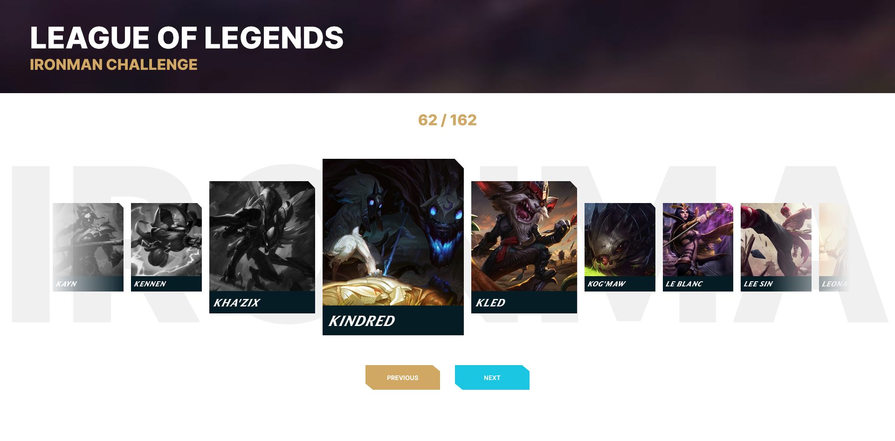

# Ironman Challenge for LoL

The Ironman Challenge is designed to test the player's endurance and ability to play a variety of characters. Traditionally played on fighting games, this webapp helps bring the challenge to League of Legends!

The exact rules can change depending on player preference. Usually, Ironman challenges need to win with every character in a row. Due to League's roster size, it's strongly recommended to instead of a complete reset, to go back one champion or to a previous "checkpoint" (like every 10 characters or each new letter). But you can play however you like!

